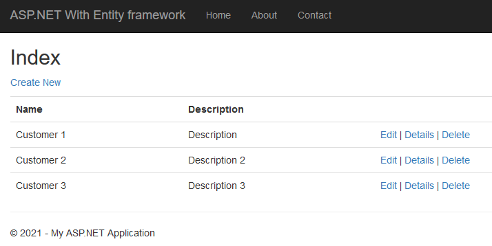
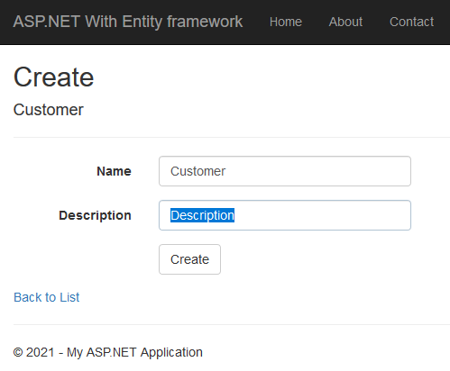
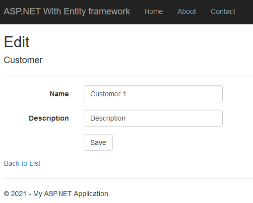
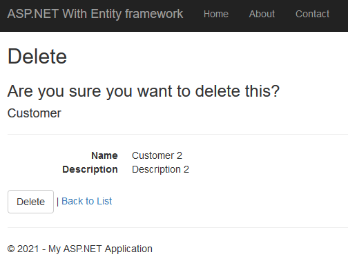

<p align="center"></p>

<h1 align="center">
    <strong>CRUD With Entity</strong>
</h1>
<h3 align="center">
    <p>ASP.NET CRUD operations with Entity framework</p>
</h3>

## Contents
- [Tools needed](#tools-needed)
- [Entity Framework](#entity-framework)
- [Creating Database](#creating-database)
- [Creating Application](#creating-application)
- [CRUD Read](#crud-read)
- [CRUD Create](#crud-create)
- [CRUD Read II](#crud-read-ii)
- [CRUD Update](#crud-update)
- [CRUD Delete](#crud-delete)

## Tools needed
* Visual Studio           - https://visualstudio.microsoft.com/
* Microsoft SQL Server    - https://www.microsoft.com/en-us/sql-server/sql-server-downloads

## Entity Framework
https://www.entityframeworktutorial.net/what-is-entityframework.aspx

Entity Framework basic workflow
<p align="center"></p>

1. First of all, you need to define your model. Defining the model includes defining your domain classes, context class derived from DbContext, and configurations (if any). EF will perform CRUD operations based on your model.
2. To insert data, add a domain object to a context and call the SaveChanges() method. EF API will build an appropriate INSERT command and execute it to the database.
3. To read data, execute the LINQ-to-Entities query in your preferred language (C#/VB.NET). EF API will convert this query into SQL query for the underlying relational database and execute it. The result will be transformed into domain (entity) objects and displayed on the UI.
4. To edit or delete data, update or remove entity objects from a context and call the SaveChanges() method. EF API will build the appropriate UPDATE or DELETE command and execute it to the database.


## Creating Database
On Microsoft SQL Server Management Studio we'll create new database called 'MvcCrud' with a table 'Customer'\
| Column Name | Data Type |
|-|-|
| Id | int |
| Name | varchar(50) |
| Description | varchar(250) |

We'll set Id as the Primary Key and set that column Identity, for auto fill

## Creating Application
On Visual Studio we create new 'ASP.NET Web Application' with MVC.\
In Models folder we add new data item 'ADO.NET Entity Data Model' with name 'DbModel' and generate from database.\
With New Connection we select our db server and select our database 'MvcCrud'.\
We'll name the entity connection to 'DbModels' and select the 'Customer' table.

Next we add 'CustomerController' controller with 'MVC 5 Controller with read/write actions' to Controllers.\
In there are all our CRUD methods.


## CRUD Read
<p align="center"></p>
In 'CustomerController' we'll set our read method.\
In namespace we add 'Models'
```
using MvcCrud.Models;
```

Inside Index action we'll retrieve all the customers from database.
```
// GET: Customer
public ActionResult Index()
{
    using(DbModels dbModels = new DbModels())
    {
        return View(dbModels.Customers.ToList());
    }
}
```

We'll right click on index and add view with 'List' template with 'Customer' model.


## CRUD Create
<p align="center"></p>
We right click on Create GET action and add view with 'Create' template and 'Customer' model.

Next we modify Create POST action as follows
```
// POST: Customer/Create
[HttpPost]
public ActionResult Create(Customer customer)
{
    try
    {
        using(DbModels dbModel = new DbModels())
        {
            dbModel.Customers.Add(customer);        // We add new customer
            dbModel.SaveChanges();                  // And we save changes
        }
        // TODO: Add insert logic here

        return RedirectToAction("Index");           // After create we return to index action
    }
    catch
    {
        return View();
    }
}
```

## CRUD Read II
Next we'll get a customer object details with 'Details' action
```
// GET: Customer/Details/5
public ActionResult Details(int id)
{
    using(DbModels dbModel = new DbModels())
    {
        return View(dbModel.Customers.Where(x => x.Id == id).FirstOrDefault());
    }
}
```

We'll right click on the details action and add new view with 'Details' template and 'Customer' class


## CRUD Update
<p align="center"></p>
First we'll right click on the Edit GET action and add view with 'Edit' template and 'Customer' class and modify class
```
// GET: Customer/Edit/5
public ActionResult Edit(int id)
{
    using (DbModels dbModel = new DbModels())
    {
        return View(dbModel.Customers.Where(x => x.Id == id).FirstOrDefault());
    }
}
```

To save our changes we need to modift Edit POST class
```
// POST: Customer/Edit/5
[HttpPost]
public ActionResult Edit(int id, Customer customer)
{
    try
    {
        using (DbModels dbModel = new DbModels())
        {
            dbModel.Entry(customer).State = EntityState.Modified;
            dbModel.SaveChanges();
        }
        // TODO: Add update logic here

        return RedirectToAction("Index");
    }
    catch
    {
        return View();
    }
}
```


## CRUD Delete
<p align="center"></p>
We modify Delete GET action as follows
```
// GET: Customer/Delete/5
public ActionResult Delete(int id)
{
    using (DbModels dbModel = new DbModels())
    {
        return View(dbModel.Customers.Where(x => x.Id == id).FirstOrDefault());
    }
}
```
And create view for it with 'Delete' template and 'Customer' class

To save delete operation we'll modify 'Delete' POST action as follows
```
// POST: Customer/Delete/5
[HttpPost]
public ActionResult Delete(int id, FormCollection collection)
{
    try
    {
        // TODO: Add delete logic here
        using(DbModels dbModel = new DbModels())
        {
            Customer customer = dbModel.Customers.Where(x => x.Id == id).FirstOrDefault();
            dbModel.Customers.Remove(customer);
            dbModel.SaveChanges();
        }

        return RedirectToAction("Index");
    }
    catch
    {
        return View();
    }
}
```

# HAPPY CODING !!! :)
